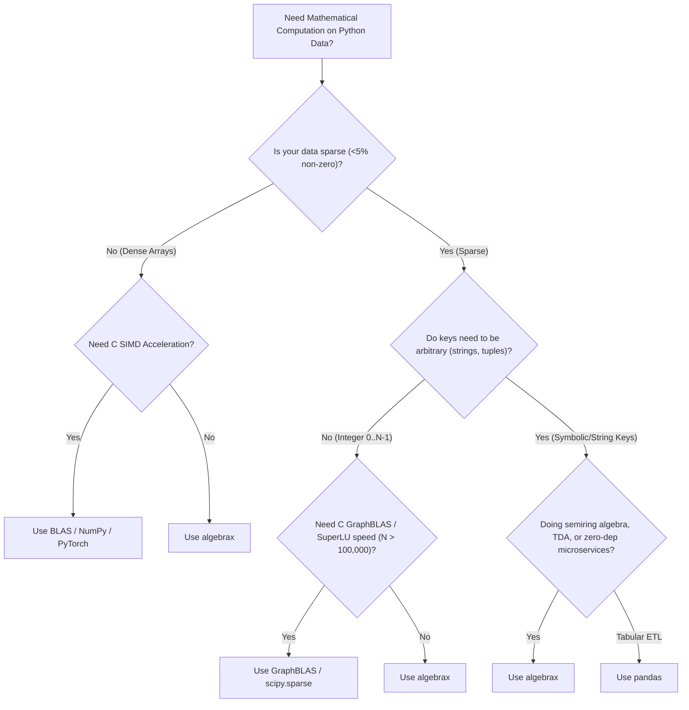

# Library Comparison & Trade-Off Analysis

`algebrax` is designed for **polymorphic semiring algebra over sparse native Python mappings**. It treats Python's
native `dict` (`SparseMatrix[K, V] = dict[K, dict[K, V]]`) as a first-class mathematical object.

This document provides a comparative analysis of `algebrax` against low-level linear algebra standards (**BLAS**,
**GraphBLAS**) and Python mathematical computing libraries (`scipy.sparse`, `numpy`, `pandas`, `networkx`, `sympy`,
`torch`).

---

## 1. Feature Matrix Overview

| Feature / Capability                          |    `algebrax`    |         BLAS (MKL/OpenBLAS)         | GraphBLAS (SuiteSparse) |           `scipy.sparse`            |               `numpy`               |    `networkx`     |      `sympy`      |
|:----------------------------------------------|:----------------:|:-----------------------------------:|:-----------------------:|:-----------------------------------:|:-----------------------------------:|:-----------------:|:-----------------:|
| **Zero Required Dependencies**                |  🟢 Pure Python  |           🔴 C / Assembly           |     🔴 C Toolchain      |           🔴 C / Fortran            |                🔴 C                 |  🟡 Pure Python   |  🟡 Pure Python   |
| **Arbitrary Hashable Keys (`str`, `tuple`)**  |  🟢 First-Class  |       🔴 Contiguous Integers        | 🔴 Contiguous Integers  |      🔴 Integer $0 \dots N-1$       |      🔴 Integer $0 \dots N-1$       |  🟢 First-Class   | 🔴 Symbolic Vars  |
| **Polymorphic Semirings $(\oplus, \otimes)$** | 🟢 24+ Built-in  | 🔴 Field $(\mathbb{R}, \mathbb{C})$ |     🟢 C Semirings      | 🔴 Field $(\mathbb{R}, \mathbb{C})$ | 🔴 Field $(\mathbb{R}, \mathbb{C})$ |      🔴 N/A       | 🔴 Symbolic Rings |
| **Sparse Structure Representation**           | 🟢 Dict-of-Dicts |            🔴 Dense Grid            |      🟢 CSR / CSC       |            🟢 CSR / CSC             |            🔴 Dense Grid            | 🟢 Adjacency Dict | 🔴 Symbolic Expr  |
| **Matrix Decompositions (LU, QR, SVD)**       |  🟢 Pure Python  |         🟢 LAPACK (`dgemm`)         |   🟡 Basic Matrix Ops   |         🟢 SuperLU / ARPACK         |              🟢 LAPACK              |      🔴 N/A       |    🟢 Symbolic    |
| **Simplicial Homology & Betti Numbers**       |   🟢 Built-in    |               🔴 N/A                |         🔴 N/A          |               🔴 N/A                |               🔴 N/A                | 🟡 Graph Cliques  |      🔴 N/A       |
| **Clifford & Galois Field Arithmetic**        |   🟢 Built-in    |               🔴 N/A                |         🔴 N/A          |               🔴 N/A                |               🔴 N/A                |      🔴 N/A       |  🟡 Basic Galois  |
| **Jupyter HTML Table/Tree Rendering**         | 🟢 `ax.display`  |             🔴 C Output             |       🔴 C Output       |           🔴 String repr            |            🔴 Array repr            |   🔴 Matplotlib   |   🟢 LaTeX repr   |

---

## 2. In-Depth Library Comparisons

### 2.1. `algebrax` vs. BLAS & GraphBLAS

#### **Standard BLAS (Basic Linear Algebra Subprograms)**

* **Domain**: Low-level C/Fortran API standard (Level 1 vector-vector, Level 2 matrix-vector, Level 3 matrix-matrix
  operations like `dgemm`).
* **Hardware Optimization**: BLAS implementations (OpenBLAS, Intel MKL, Apple Accelerate) are heavily optimized for CPU
  cache locality, SIMD vector instructions (AVX-512, ARM Neon), and multi-core hardware threading.
* **Key Differences with `algebrax`**:
    * **Memory & Storage**: BLAS operates on contiguous 1D/2D arrays in C memory order. `algebrax` operates on dynamic
      sparse nested dictionaries (`dict[K, dict[K, V]]`).
    * **Domain Focus**: BLAS is designed for high-density floating-point arithmetic. `algebrax` is designed for sparse
      symbolic structural computations.

#### **GraphBLAS (SuiteSparse:GraphBLAS)**

* **Domain**: C API standard specifying matrix multiplication over arbitrary semirings ($\oplus, \otimes$) for
  high-performance graph processing.
* **Key Differences with `algebrax`**:
    * **Index Representation**: GraphBLAS matrices require contiguous 0-indexed integers ($0 \dots N-1$) stored in
      Compressed Sparse Row/Column (CSR/CSC) formats. `algebrax` supports arbitrary symbolic keys (`str`, `tuple`,
      `UUID`, custom objects) directly without string-to-integer mapping tables.
    * **Environment**: GraphBLAS requires a compiled C environment (such as `SuiteSparse` compiled shared libraries).
      `algebrax` runs out-of-the-box on any Python interpreter (PyPy, CPython 3.10–3.14) with **zero C dependencies**.
    * **Multidimensional Extension**: GraphBLAS is strictly restricted to 2D matrices. `algebrax` extends semiring
      matrix multiplication into multidimensional sparse tensors (`ax.tensor.einsum`), tensor prefix trees
      (`AlgebraicTrie`), and simplicial chain complexes (`SimplicialComplex`).

* **When to use GraphBLAS**: Large-scale graph computations on static integer-indexed graphs ($N > 1,000,000$ nodes) in
  C/C++ environments.
* **When to use `algebrax`**: Lightweight Python microservices, dynamic knowledge graphs with string keys, topological
  homology calculations, or zero-dependency pure Python deployments.

---

### 2.2. `algebrax` vs. `scipy.sparse`

* **Domain**: `scipy.sparse` is the industry standard for large-scale numerical linear algebra in Python (Finite Element
  Analysis, Partial Differential Equations).
* **Key Differences**:
    * **Index Types**: `scipy.sparse` requires integer indices $\{0, 1, \dots, N-1\}$. `algebrax` supports any hashable
      Python object (e.g. `"User_123"`, `("rule_A", "step_1")`).
    * **Algebraic Polymorphism**: `scipy.sparse` computes standard numerical arithmetic ($+, \times$). `algebrax` allows
      swapping the underlying semiring parameter in `ax.matrix.dot()` to compute shortest paths ($(\min, +)$),
      reachability ($(\lor, \land)$), or symbolic provenance polynomials ($\mathbb{N}[X]$).
    * **Dependencies**: `scipy.sparse` requires compiling C/Fortran code and depends on `numpy`. `algebrax` is 100% pure
      Python with zero build dependencies.
* **When to use `scipy.sparse`**: Large numerical simulations ($N > 10,000$) where raw C performance is required.
* **When to use `algebrax`**: Heterogeneous sparse graphs, knowledge graphs, semiring optimization, or zero-dependency
  lightweight deployments.

---

### 2.3. `algebrax` vs. `numpy`

* **Domain**: `numpy` is the standard for dense multi-dimensional numerical array computation.
* **Key Differences**:
    * **Sparsity**: `numpy` allocates $N \times N$ dense memory blocks. For $1,000 \times 1,000$ matrices with 0.1%
      non-zero elements, `numpy` allocates 1,000,000 entries; `algebrax` allocates only 1,000 non-zero entries ($O (k)$
      memory).
    * **Interop**: `algebrax` provides soft-dependency converters (`ax.converters.to_numpy`, `ax.converters.from_numpy`)
      for seamless interoperability.
* **When to use `numpy`**: Dense matrix calculations, image processing arrays, and fixed-size tensor layers.
* **When to use `algebrax`**: Highly sparse data (density $< 5\%$) with non-numeric or string keys.

---

### 2.4. `algebrax` vs. `pandas`

* **Domain**: `pandas` focuses on tabular data analysis, data cleaning, and ETL pipelines.
* **Key Differences**:
    * **Mathematical Operations**: `pandas` DataFrames are not optimized for algebraic operations like matrix
      multiplication, tensor contraction, or matrix decompositions.
    * **Structure**: `algebrax` dictionaries behave as formal mathematical vectors and tensors, whereas `pandas`
      structures treat data as 2D tables with index/column metadata.
* **When to use `pandas`**: CSV/SQL data ingestion, time-series aggregation, and data cleaning.
* **When to use `algebrax`**: Graph algorithms, matrix multiplication over semirings, and topological data analysis.

---

### 2.5. `algebrax` vs. `networkx`

* **Domain**: `networkx` is a popular Python library for graph theory and network analysis.
* **Key Differences**:
    * **Algorithmic Paradigm**: `networkx` uses object-oriented graph traversal algorithms (`nx.shortest_path(G)`).
      `algebrax` unifies graph algorithms into matrix multiplication over semirings ($M^k$ under
      `ax.semiring.TropicalSemiring`).
    * **Multidimensional Structures**: `algebrax` extends naturally from matrices to high-dimensional sparse tensors
      (`ax.tensor.einsum`), tries (`AlgebraicTrie`), simplicial chain complexes (`SimplicialComplex`), and multivectors
      (`CliffordSemiring`).
* **When to use `networkx`**: Traditional graph visualization and standard graph algorithm suites.
* **When to use `algebrax`**: Unified matrix-semiring graph computing, topological data analysis (Betti numbers), and
  algebraic state machine simulations.

---

### 2.6. `algebrax` vs. `sympy`

* **Domain**: `sympy` is a computer algebra system (CAS) for exact symbolic mathematics (calculus, symbolic equations).
* **Key Differences**:
    * **Symbolic Keys vs. Expressions**: `sympy` manipulates symbolic expression trees (`x**2 + sin(y)`). `algebrax`
      uses native Python objects (`dict`, `tuple`, `str`) as vector/matrix indices and offers polynomial semirings
      (`ProvenanceSemiring`, `MonoidAlgebraSemiring`) for fast rule tracking.
    * **Performance**: `algebrax` sparse dict operations execute much faster than `sympy` expression tree traversals for
      large structural computations.
* **When to use `sympy`**: Symbolic differentiation, exact equation solving, and continuous calculus.
* **When to use `algebrax`**: Sparse discrete algebra, semiring matrix operations, and topological data analysis.

---

## 3. Decision Tree: Choosing the Right Library



---

## 4. Ecosystem Interoperability

`algebrax` includes soft-dependency bridges (`algebrax.converters`) to interoperate with standard PyData libraries
without adding hard dependencies:

```python
import algebrax as ax

# 1. Define sparse dictionary matrix in algebrax
sparse_mat = {0: {1: 2.5}, 1: {0: 1.5, 2: 4.0}}

# 2. Convert to NumPy 2D array (soft dependency on numpy)
np_arr = ax.converters.to_numpy(sparse_mat, shape=(3, 3))

# 3. Convert back to algebrax sparse dict
recovered_mat = ax.converters.from_numpy(np_arr)
assert recovered_mat == sparse_mat
```
