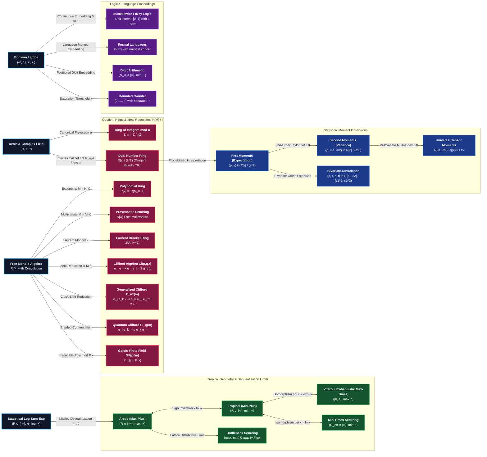

# Semiring Architecture & Mathematical Taxonomy

In **AlgebraX**, semirings $(S, \oplus, \otimes, \mathbf{0}, \mathbf{1})$ serve as the unifying polymorphic foundation
for sparse linear algebra, graph algorithms, formal language parsing, optimization, information theory, and geometric
physics.

To provide total conceptual clarity, this guide presents **two complementary architectural diagrams**:

1. **[Software & Implementation Architecture](#1-software-implementation-architecture)**: Shows Python class
   hierarchies, module namespaces, protocol conformance, and recipe carrier polymorphism.
2. **[Mathematical Morphisms & Structural Correspondences](#2-mathematical-morphisms-structural-correspondences)**:
   Shows pure algebraic homomorphisms, quotient ring reductions, Maslov tropical dequantization limits, logarithmic
   isomorphisms, and continuous logic embeddings.

---

## 1. Software & Implementation Architecture

This diagram illustrates the software organization of `algebrax.semiring`, showing how classes inherit, specialize, and
compose across modules and user recipes:

```mermaid
flowchart LR
%% Styling Classes
    classDef base fill:#0f172a,stroke:#38bdf8,stroke-width:2px,color:#f8fafc;
    classDef arith fill:#1e3a8a,stroke:#60a5fa,stroke-width:1.5px,color:#f8fafc;
    classDef opt fill:#14532d,stroke:#4ade80,stroke-width:1.5px,color:#f8fafc;
    classDef logic fill:#581c87,stroke:#c084fc,stroke-width:1.5px,color:#f8fafc;
    classDef stat fill:#701a75,stroke:#f472b6,stroke-width:1.5px,color:#f8fafc;
    classDef alg fill:#7c2d12,stroke:#fb923c,stroke-width:1.5px,color:#f8fafc;
    classDef quote fill:#831843,stroke:#f43f5e,stroke-width:2px,color:#f8fafc;
    classDef recipe fill:#312e81,stroke:#a5b4fc,stroke-width:1.5px,stroke-dasharray: 5 5,color:#f8fafc;

%% Base Protocol
    Root["<b>Semiring[V] Protocol</b><br/><i>algebrax.semiring._base</i><br/>add, mul, zero, one, power, star, nsum"]:::base

%% Module: arithmetic.py
    subgraph ModArith["algebrax.semiring.arithmetic"]
        Standard["<b>StandardSemiring[T]</b><br/>Python + and *"]:::arith
        Modular["<b>ModularSemiring</b><br/>Integer modulo n"]:::arith
    end

%% Module: optimization.py
    subgraph ModOpt["algebrax.semiring.optimization"]
        Tropical["<b>TropicalSemiring</b>"]:::opt
        Arctic["<b>ArcticSemiring</b>"]:::opt
        Viterbi["<b>ViterbiSemiring</b>"]:::opt
        Reliability["<b>ReliabilitySemiring</b>"]:::opt
        Bottleneck["<b>BottleneckSemiring</b>"]:::opt
        MinTimes["<b>MinTimesSemiring</b>"]:::opt
    end

%% Module: logic.py & structures.py
    subgraph ModLogic["algebrax.semiring.logic & structures"]
        Boolean["<b>BooleanSemiring</b>"]:::logic
        Digital["<b>DigitalSemiring</b>"]:::logic
        Lukasiewicz["<b>LukasiewiczSemiring</b>"]:::logic
        String["<b>StringSemiring</b>"]:::logic
        KCollapsed["<b>KCollapsedSemiring</b>"]:::logic
    end

%% Module: statistical.py
    subgraph ModStat["algebrax.semiring.statistical"]
        Log["<b>LogSemiring</b><br/>LogSumExp algebra"]:::stat
        Expectation["<b>ExpectationSemiring</b><br/>1st Moment (p, v)"]:::stat
        Variance["<b>VarianceSemiring</b><br/>2nd Moment (p, m1, m2)"]:::stat
        Skewness["<b>SkewnessSemiring</b><br/>3rd Moment (p, m1, m2, m3)"]:::stat
        Kurtosis["<b>KurtosisSemiring</b><br/>4th Moment (p, m1,..., m4)"]:::stat
        StatisticalMoment["<b>StatisticalMomentSemiring[K]</b><br/>Universal 1D Decoders"]:::stat
        BivarVariance["<b>BivariateVarianceSemiring</b><br/>Bivariate 4-tuple (p, r, s, t)"]:::stat
        MultiMoment["<b>MultivariateMomentSemiring[d, K]</b><br/>Covariance Matrix & Hessian"]:::stat
    end

%% Module: algebraic.py
    subgraph ModAlg["algebrax.semiring.algebraic"]
        DualNum["<b>DualNumberSemiring</b><br/>tuple[float, float]"]:::alg
        BinomialConv["<b>BinomialConvolutionSemiring[K]</b><br/>Divided Power Ring R[ε]/(ε^{K+1})"]:::alg
        MultiBinomialConv["<b>MultivariateBinomialConvolutionSemiring[d, K]</b><br/>Multi-Index Total Degree Quotient Ring"]:::alg
        MonoidAlg["<b>MonoidAlgebraSemiring[K, T]</b><br/>Sparse dict[K, T] convolution"]:::alg
        Polynomial["<b>PolynomialSemiring[T]</b><br/>Subclass of MonoidAlgebra"]:::alg
        Provenance["<b>ProvenanceSemiring</b><br/>Subclass of MonoidAlgebra"]:::alg
        Knot["<b>KnotSemiring</b><br/>Subclass of MonoidAlgebra"]:::alg
        QuotientAlg["<b>QuotientMonoidAlgebraSemiring</b><br/>Subclass with quotient_fn reduction"]:::quote
        Clifford["<b>CliffordSemiring</b><br/>Quotient factory: Cl(p, q, r)"]:::quote
        GCA["<b>GeneralizedCliffordSemiring</b><br/>Quotient factory: C_n^(m)"]:::quote
        QuantumClifford["<b>QuantumCliffordSemiring</b><br/>Quotient factory: Cl_q(m)"]:::quote
        GaloisField["<b>GaloisFieldSemiring</b><br/>Quotient factory: GF(p^m)"]:::quote
    end

%% Recipes Extensibility Subgraph
    subgraph ModRecipe["Applied Recipes (Carrier & Class Extensions)"]
        Interval["<b>IntervalSemiring</b><br/>Custom Semiring[tuple[float, float]]"]:::recipe
        Grammar["<b>GrammarSemiring</b><br/>Custom Semiring[set[str]]"]:::recipe
        DualClass["<b>DualNumber Class</b><br/>Used via StandardSemiring(dtype=DualNumber)"]:::recipe
        GradDualClass["<b>GradientDualNumber Class</b><br/>Used via StandardSemiring(dtype=GradDual)"]:::recipe
    end

%% Implementation Connections
    Root -->|Implements| Standard
    Root -->|Implements| Modular
    Root -->|Implements| Tropical
    Root -->|Implements| Arctic
    Root -->|Implements| Viterbi
    Root -->|Implements| Reliability
    Root -->|Implements| Bottleneck
    Root -->|Implements| MinTimes
    Root -->|Implements| Boolean
    Root -->|Implements| Digital
    Root -->|Implements| Lukasiewicz
    Root -->|Implements| String
    Root -->|Implements| KCollapsed
    Root -->|Implements| Log
    Root -->|Implements| BivarVariance
    Root -->|Implements| DualNum
    Root -->|Implements| BinomialConv
    Root -->|Implements| MultiBinomialConv
    Root -->|Implements| MonoidAlg

%% Class Specializations & Subclassing
    DualNum -->|Subclasses| Expectation
    BinomialConv -->|Subclasses| StatisticalMoment
    StatisticalMoment -->|Specializes| Variance
    StatisticalMoment -->|Specializes| Skewness
    StatisticalMoment -->|Specializes| Kurtosis
    MultiBinomialConv -->|Subclasses| MultiMoment

    MonoidAlg -->|Subclasses| Polynomial
    MonoidAlg -->|Subclasses| Provenance
    MonoidAlg -->|Subclasses| Knot
    MonoidAlg -->|Subclasses| QuotientAlg

    QuotientAlg -->|Configures| Clifford
    QuotientAlg -->|Configures| GCA
    QuotientAlg -->|Configures| QuantumClifford
    QuotientAlg -->|Configures| GaloisField

%% Recipe Connections
    Root -.->|User Implementation| Interval
    Root -.->|User Implementation| Grammar
    Standard -.->|Carrier Type Dtype| DualClass
    Standard -.->|Carrier Type Dtype| GradDualClass

%% Click Navigation Links
    click Standard "arithmetic.md" "StandardSemiring Tutorial"
    click Modular "arithmetic.md" "ModularSemiring Tutorial"
    click Tropical "optimization.md" "TropicalSemiring Tutorial"
    click Arctic "optimization.md" "ArcticSemiring Tutorial"
    click Viterbi "optimization.md" "ViterbiSemiring Tutorial"
    click Reliability "optimization.md" "ReliabilitySemiring Tutorial"
    click Bottleneck "optimization.md" "BottleneckSemiring Tutorial"
    click MinTimes "optimization.md" "MinTimesSemiring Tutorial"
    click Boolean "logic.md" "BooleanSemiring Tutorial"
    click Digital "logic.md" "DigitalSemiring Tutorial"
    click Lukasiewicz "logic.md" "LukasiewiczSemiring Tutorial"
    click String "logic.md" "StringSemiring Tutorial"
    click KCollapsed "logic.md" "KCollapsedSemiring Tutorial"
    click Log "statistical.md" "LogSemiring Tutorial"
    click DualNum "algebraic.md" "DualNumberSemiring Tutorial"
    click Expectation "statistical.md" "ExpectationSemiring Tutorial"
    click Variance "statistical.md" "VarianceSemiring Tutorial"
    click BivarVariance "statistical.md" "BivariateVarianceSemiring Tutorial"
    click Skewness "statistical.md" "SkewnessSemiring Tutorial"
    click Kurtosis "statistical.md" "KurtosisSemiring Tutorial"
    click StatisticalMoment "statistical.md" "StatisticalMomentSemiring Tutorial"
    click BinomialConv "algebraic.md" "BinomialConvolutionSemiring Tutorial"
    click MultiBinomialConv "algebraic.md" "MultivariateBinomialConvolutionSemiring Tutorial"
    click MultiMoment "statistical.md" "MultivariateMomentSemiring Tutorial"
    click MonoidAlg "algebraic.md" "MonoidAlgebraSemiring Tutorial"
    click Polynomial "algebraic.md" "PolynomialSemiring Tutorial"
    click Provenance "algebraic.md" "ProvenanceSemiring Tutorial"
    click Knot "algebraic.md" "KnotSemiring Tutorial"
    click QuotientAlg "algebraic.md" "QuotientMonoidAlgebraSemiring Tutorial"
    click Clifford "algebraic.md" "CliffordSemiring Tutorial"
    click GCA "algebraic.md#generalized-clifford-algebras-gcas-clock-and-shift" "GeneralizedCliffordSemiring Tutorial"
    click QuantumClifford "algebraic.md#q-deformed-quantum-clifford-algebras" "QuantumCliffordSemiring Tutorial"
    click GaloisField "algebraic.md" "GaloisFieldSemiring Tutorial"
    click Interval "../../recipes.md" "IntervalSemiring in Recipes"
    click Grammar "../../recipes.md" "GrammarSemiring in Recipes"
    click DualClass "../../recipes.md" "DualNumber in Recipes"
    click GradDualClass "../../recipes.md" "GradientDualNumber in Recipes"
```



---

## 2. Mathematical Morphisms & Structural Correspondences

This diagram illustrates pure algebraic structure, showing how semirings relate via **quotient projections**, **Maslov
dequantization limits**, **logarithmic isomorphisms**, and **domain embeddings**:



---

## 3. Mathematical Semantics & Morphism Legend

| Transformation Category              | Mathematical Formulation                                                                            | Description                                                                                                                         | Examples                                                                                            |
|:-------------------------------------|:----------------------------------------------------------------------------------------------------|:------------------------------------------------------------------------------------------------------------------------------------|:----------------------------------------------------------------------------------------------------|
| **Quotient Ring Projections**        | $R[M] \twoheadrightarrow R[M] / \mathcal{I}$                                                        | Imposing defining polynomial or commutation relations on a free algebra.                                                            | $e_i e_j = -e_j e_i$ (Clifford), $e_j e_k = \omega e_k e_j$ (GCA), $\epsilon^2 = 0$ (Dual Numbers). |
| **Maslov Tropical Dequantization**   | $\lim_{\hbar \to 0} \hbar \ln\left(e^{a/\hbar} + e^{b/\hbar}\right) = \max(a, b)$                   | The semi-classical limit translating statistical mechanics (partition functions) into idempotent tropical geometry (optimal paths). | `LogSemiring` $\to$ `ArcticSemiring` (Max-Plus).                                                    |
| **Logarithmic Isomorphisms**         | $\phi(x) = e^{-x}: (\mathbb{R} \cup \{\infty\}, \min, +) \xrightarrow{\cong} ([0, 1], \max, \cdot)$ | Exact bijective homomorphic maps between additive shortest paths and multiplicative probabilities.                                  | `TropicalSemiring` $\leftrightarrow$ `ViterbiSemiring`.                                             |
| **Continuous & Language Embeddings** | $\{0, 1\} \hookrightarrow [0, 1]$<br/>$\{0, 1\} \hookrightarrow \mathcal{P}(\Sigma^*)$              | Embedding two-valued discrete logic into continuous fuzzy intervals or non-commutative formal language powersets.                   | `BooleanSemiring` $\to$ `LukasiewiczSemiring`, `StringSemiring`.                                    |
| **Higher-Order Jet Lifts**           | $T\mathbb{R} \to T^{(K)}\mathbb{R} \cong \mathbb{R}[\epsilon] / (\epsilon^{K+1})$                   | Expanding 1st-order tangent bundle expectations to variance, skewness, kurtosis, and multivariate covariance tensors.               | `DualNumberSemiring` $\to$ `VarianceSemiring` $\to$ `MultivariateMomentSemiring`.                   |

---

## 4. Domain Taxonomy & Categorization

| Category                          | Semiring Class                                                                                           | Carrier Set                                        |                       $\oplus$ (Add)                       |        $\otimes$ (Mul)         | Neutral Elements ($\mathbf{0}, \mathbf{1}$) | Primary Applications                                                            |
|:----------------------------------|:---------------------------------------------------------------------------------------------------------|:---------------------------------------------------|:----------------------------------------------------------:|:------------------------------:|:-------------------------------------------:|:--------------------------------------------------------------------------------|
| **Arithmetic**                    | [`StandardSemiring[T]`](arithmetic.md)                                                            | $\mathbb{R}$ or $\mathbb{C}$                       |                            $+$                             |            $\cdot$             |                   $0, 1$                    | Classical Linear Algebra, Physics, PDEs                                         |
|                                   | [`ModularSemiring`](arithmetic.md)                                                                 | $\mathbb{Z}_n$                                     |                        $+ \bmod n$                         |        $\cdot \bmod n$         |                   $0, 1$                    | Cryptography, Hash Functions, Number Theory                                     |
| **Optimization**                  | [`TropicalSemiring`](optimization.md)                                                               | $\mathbb{R} \cup \{\infty\}$                       |                           $\min$                           |              $+$               |                 $\infty, 0$                 | Shortest Paths (Dijkstra, Floyd-Warshall)                                       |
|                                   | [`ArcticSemiring`](optimization.md)                                                                 | $\mathbb{R} \cup \{-\infty\}$                      |                           $\max$                           |              $+$               |                $-\infty, 0$                 | Critical Path Latency, Maximum Scheduling                                       |
|                                   | [`ViterbiSemiring`](optimization.md)                                                                 | $[0, 1]$                                           |                           $\max$                           |            $\cdot$             |                   $0, 1$                    | Hidden Markov Models, Speech & Gene Parsing                                     |
|                                   | [`ReliabilitySemiring`](optimization.md)                                                             | $[0, 1]$                                           |                           $\max$                           |            $\cdot$             |                   $0, 1$                    | Network Reliability & Survivability                                             |
|                                   | [`BottleneckSemiring`](optimization.md)                                                           | $\mathbb{R} \cup \{\pm\infty\}$                    |                           $\max$                           |             $\min$             |              $-\infty, \infty$              | Widest Path, Capacity Bottlenecks                                               |
|                                   | [`MinTimesSemiring`](optimization.md)                                                             | $\mathbb{R}_{\ge 0} \cup \{\infty\}$               |                           $\min$                           |            $\cdot$             |                 $\infty, 1$                 | Optimal Cost Multipliers                                                        |
|                                   | [`LogSemiring`](statistical.md)                                                                 | $\mathbb{R} \cup \{-\infty\}$                      |                     $\text{LogSumExp}$                     |              $+$               |                $-\infty, 0$                 | Statistical Physics, Free Energy, Belief Propagation                            |
| **Logic**                         | [`BooleanSemiring`](logic.md)                                                                 | $\{0, 1\}$                                         |                           $\lor$                           |            $\land$             |                   $0, 1$                    | Transitive Closure, Reachability, CYK Parsing                                   |
|                                   | [`DigitalSemiring`](logic.md)                                                                 | $\mathbb{N}_0 \cup \{\infty\}$                     |                           $\min$                           |              $+$               |                 $\infty, 0$                 | Post-Quantum Cryptography (Ring-LWE), Digital Filters                           |
|                                   | [`LukasiewiczSemiring`](logic.md)                                                         | $[0, 1]$                                           |                           $\max$                           |        $\max(0, x+y-1)$        |                   $0, 1$                    | Multi-Valued Logic, Fuzzy Reasoning                                             |
|                                   | [`StringSemiring`](logic.md)                                                              | $\mathcal{P}(\Sigma^*)$                            |                           $\cup$                           |             Concat             |          $\emptyset, \{\epsilon\}$          | Formal Languages, Finite Automata Contraction                                   |
|                                   | [`KCollapsedSemiring`](logic.md)                                                          | $\{0, \dots, k\}$                                  |                       $\min(k, x+y)$                       |         $\min(k, xy)$          |                   $0, 1$                    | Resource Counting, Bounded Semaphores                                           |
| **Statistical**                   | [`ExpectationSemiring`](statistical.md)                                                         | $\mathbb{R}_{\ge 0} \times \mathbb{R}$             |                        Elementwise                         | $(p_1 p_2, p_1 v_2 + p_2 v_1)$ |              $(0, 0), (1, 0)$               | Expected Values, Loss Accumulation                                              |
|                                   | [`VarianceSemiring`](statistical.md)                                                            | $\mathbb{R}^3$                                     |                          Moments                           |        Binomial Convol.        |                 Zero / Unit                 | 2nd Raw & Central Moments, Univariate Variance                                  |
|                                   | [`SkewnessSemiring`](statistical.md)                                                            | $\mathbb{R}^4$                                     |                          Moments                           |        Binomial Convol.        |                 Zero / Unit                 | Third Central Moments, Asymmetry / Skewness Risk                                |
|                                   | [`KurtosisSemiring`](statistical.md)                                                            | $\mathbb{R}^5$                                     |                          Moments                           |        Binomial Convol.        |                 Zero / Unit                 | Fourth Central Moments, Fat-Tail Kurtosis Risk                                  |
|                                   | [`StatisticalMomentSemiring`](statistical.md)                                                   | $\mathbb{R}^{K+1}$                                 |                       Componentwise                        |        Binomial Convol.        |                 Zero / Unit                 | Universal 1D Moments, Full Statistical Metric Decoders                          |
|                                   | [`BivariateVarianceSemiring`](statistical.md)                                                   | $\mathbb{R}^4$                                     |                          Moments                           |          Composition           |                 Zero / Unit                 | Bivariate Cross-Covariance (Li & Eisner)                                        |
|                                   | [`MultivariateMomentSemiring`](statistical.md)                                                  | $\text{Sparse } \mathbb{R}^{\binom{d+K}{K}}$       |                      Sparse Poly $+$                       |     Multi-Binomial Convol.     |                 Zero / Unit                 | Multivariate Mean Vectors, $d \times d$ Covariance Matrix $\boldsymbol{\Sigma}$ |
| **Algebraic**                     | [`BinomialConvolutionSemiring`](statistical.md)                                                 | $\mathbb{R}[\epsilon]/(\epsilon^{K+1})$            |                       Componentwise                        |        Binomial Convol.        |          $(0,\dots), (1,0,\dots)$           | Universal Divided Power Quotient Algebra                                        |
|                                   | [`MultivariateBinomialConvolutionSemiring`](statistical.md)                                     | $\mathbb{R}[\boldsymbol{\epsilon}]/\langle |\boldsymbol{\beta}|=K+1\rangle$ | Componentwise $+$ | Multi-Binomial Convol. | $\emptyset, \{(0,\dots): 1.0\}$ | Multi-Index Total Degree Quotient Ring |
|                                   | [`DualNumberSemiring`](statistical.md)                                                          | $\mathbb{R}[\epsilon]/\epsilon^2$                  |                    $(u+v, u\x27+v\x27)$                    |     $(uv, uv\x27+u\x27v)$      |              $(0, 0), (1, 0)$               | Forward-Mode Automatic Differentiation                                          |
|                                   | [`MonoidAlgebraSemiring`](algebraic.md)                                                    | $R[M]$                                             |                         Linear Sum                         |          Convolution           |       $\emptyset, \{e: \mathbf{1}\}$        | Group Rings, Signal Transforms                                                  |
|                                   | [`PolynomialSemiring`](algebraic.md)                                                           | $R[x]$                                             |                       Polynomial $+$                       |         Cauchy Product         |       $\emptyset, \{0: \mathbf{1}\}$        | Generating Functions, Control Theory                                            |
|                                   | [`ProvenanceSemiring`](algebraic.md)                                                           | $\mathbb{N}[X]$                                    |                          Poly $+$                          |          Poly $\cdot$          |           $\emptyset, \{(): 1\}$            | Database Provenance, Parsing Derivation Trees                                   |
|                                   | [`KnotSemiring`](algebraic.md)                                                                       | $\mathbb{Z}[A, A^{-1}]$                            |                          Poly $+$                          |          Poly $\cdot$          |    $\emptyset, \{\text{\x27U\x27}: 1\}$     | Topological Knot Invariants (Kauffman Bracket)                                  |
|                                   | [`QuotientMonoidAlgebraSemiring`](algebraic.md)                                   | $R[M] / \mathcal{I}$                               |                         Linear Sum                         |        Quotient Convol.        |       $\emptyset, \{e: \mathbf{1}\}$        | Universal Quotient Ring Framework                                               |
|                                   | [`CliffordSemiring`](algebraic.md)                                                               | $Cl(p, q, r)$                                      |                         Blade $+$                          |        Geometric Prod.         |          $\emptyset, \{(): 1.0\}$           | 3D/4D Rotors, Spacetime Physics, Dirac Spinors                                  |
|                                   | [`GeneralizedCliffordSemiring`](algebraic.md#generalized-clifford-algebras-gcas-clock-and-shift) | $C_n^{(m)}$                                        |                         Blade $+$                          |        Clock-and-Shift         |       $\emptyset, \{(0,\dots): 1.0\}$       | Discrete Weyl Quantization, Root-of-Unity Algebras                              |
|                                   | [`QuantumCliffordSemiring`](algebraic.md#q-deformed-quantum-clifford-algebras)                   | $Cl_q(m)$                                          |                         Blade $+$                          |       $q$-Braided Prod.        |       $\emptyset, \{(0,\dots): 1.0\}$       | Quantum Groups, Braided Tensor Geometry                                         |
|                                   | [`GaloisFieldSemiring`](algebraic.md)                                                              | $GF(p^m)$                                          |                      Poly $+ \bmod p$                      |    Poly $\cdot \bmod P(x)$     |            $\emptyset, \{0: 1\}$            | Finite Field Cryptography, AES S-Box                                            |
| **Recipe Extensions** *(Applied)* | [`MatrixSemiring`](../../recipes.md) | $\mathbb{R}^{d \times d}$ (Matrices) | Elementwise $\min$ | Matrix Mul ($A B$) | $\infty \cdot \mathbf{J}, \mathbf{I}_d$ | Vector Bundles, Parallel Transport, Gauge Kinematics |
|                                   | [`IntervalSemiring`](../../recipes.md)                                                                                       | $[\underline{x}, \overline{x}] \subset \mathbb{R}$ | $[\underline{a}+\underline{b}, \overline{a}+\overline{b}]$ |       Interval $\times$        |              $[0, 0], [1, 1]$               | Bounded Uncertainty Analysis, Robust Control                                    |
|                                   | `GrammarSemiring`                                                                                        | $\mathcal{P}(\text{NonTerminals})$                 |                           $\cup$                           |       $A \Rightarrow BC$       |      $\emptyset, \{\text{\x27S\x27}\}$      | CYK Grammar Parsing, NLP Derivations                                            |
|                                   | `VectorClockSemilattice`                                                                                 | $\mathbb{N}_0^K$                                   |                     $\max$ (LUB Join)                      |         Component $+$          |          $\mathbf{0}, \mathbf{0}$           | Distributed Systems Causality & CRDT Synchronization                            |
|                                   | `GradientDualNumber`                                                                                     | $\mathbb{R} \times \mathbb{R}^K$                   |                      Elementwise $+$                       |      Leibniz $\nabla(uv)$      |                   $0, 1$                    | Multivariate Forward-Mode Jacobian Tracking                                     |

---

## 5. Verifying Semiring Properties

To formally verify that any custom or built-in semiring satisfies all 9 algebraic axioms:

```python
import algebrax as ax

# Test all 9 axioms with numerical/sparse equality checks
results = ax.verification.verify_semiring_laws(
   semiring=ax.semiring.TropicalSemiring(),
   samples=[float("inf"), 0.0, 1.5, 4.0, 10.0]
)

print("Axiom Audit Results:", results)
# Output: {"add_associativity": True, "add_commutativity": True, "add_identity": True, ...}
```

For more details, see the [Algebraic Law Verification Tutorial](verification.md).
