# EP-0099: Master Expansion Roadmap & Unified Algebraic Architecture

| Field       | Value                                                     |
|:------------|:----------------------------------------------------------|
| **EP**      | 0099                                                      |
| **Title**   | Master Expansion Roadmap & Unified Algebraic Architecture |
| **Author**  | Eran Rivlis & Antigravity                                 |
| **Status**  | Active                                                    |
| **Type**    | Informational                                             |
| **Created** | 2026-08-01                                                |
| **Updated** | 2026-09-10                                                |

## Abstract

This proposal establishes the strategic roadmap and architectural blueprint for expanding `algebrax` into advanced
mathematical domains. It connects core primitives (`SparseVector`, `SparseMatrix`, `Semiring`, `AlgebraicTrie`) through
two foundational engine extensions (`EP-0100` and `EP-0101`) to four specialized domain modules (`EP-0110` through
`EP-0113`), an interactive visual studio (`EP-0120`), a maturity & consistency track (`EP-0130` through `EP-0134`),
the Phase 3.5 Council Refinement Track (`EP-0140` through `EP-0146`), formalized micro-benchmarking (`EP-0148`),
universal binomial convolution statistical moment semirings (`EP-0149`), standardized mathematical docstrings (`EP-0150`),
algebraic PageRank contraction solvers over semirings (`EP-0151`), Spectral Graph Theory with Graph Laplacians
and Fiedler partitioning (`EP-0152`), and the **Phase 4 Algebraic Continents & Next Frontiers** (`EXP-0001`,
`EP-0160` through `EP-0163`) extending into Discrete Exterior Calculus and continuous Lie symmetries.

---

## The Master Dependency & Connection Graph

```mermaid
flowchart TD
    CORE["algebrax Core Foundations\n(Sparse Mappings + Semirings + Tries)"]

    CORE --> EP0100["EP-0100\nQuotient Monoid Algebra"]
    CORE --> EP0101["EP-0101\nSparse Chain Complex"]
    CORE --> EP0149["EP-0149\nBinomial Moments & Divided Powers"]
    CORE --> EP0163["EP-0163\nLie Bracket & BCH Dynamics"]

    EP0100 --> EP0111["EP-0111\nClifford Algebra"]
    EP0100 --> EP0112["EP-0112\nGalois Fields"]
    EP0100 --> KNOT["Knot Skein Modules\n(Existing)"]

    EP0101 --> EP0110["EP-0110\nSimplicial Homology"]
    EP0101 --> SHEAF["Sheaf Consensus\n(Existing)"]
    EP0101 --> EP0113["EP-0113\nCategory Kleisli"]
    EP0101 --> EP0160["EP-0160\nDiscrete Exterior Calculus"]

    EP0110 --> P3
    EP0111 --> P3
    EP0111 --> EP0163
    EP0112 --> P3
    EP0113 --> P3
    EP0149 --> P35

    subgraph P3["Phase 3 — Explorer, Maturity & Curiosity"]
        EP0120["EP-0120 Web Explorer"]
        EP0130["EP-0130 API Consistency ✅"]
        EP0131["EP-0131 Law Verification ✅"]
        EP0132["EP-0132 Matrix Decompositions ✅"]
        EP0133["EP-0133 Jupyter & CLI ✅"]
        EP0134["EP-0134 Semiring Namespaces ✅"]
    end

    P3 --> P35

    subgraph P35["Phase 3.5 — Council Refinement Track"]
        EP0140["EP-0140 API Symmetry ✅\n⚖️ Noether"]
        EP0141["EP-0141 Taxonomy Cleanup ✅\n🧩 Russell"]
        EP0142["EP-0142 Performance ✅\n⚡ Shannon"]
        EP0143["EP-0143 Documentation ✅\n💡 Feynman"]
        EP0144["EP-0144 Testing ✅\n🔬 Popper"]
        EP0145["EP-0145 Type Safety ✅\n🛡️ Golem"]
        EP0146["EP-0146 Ergonomics ✅\n🤝 Steward"]
        EP0148["EP-0148 Benchmarking ✅\n⏱️ CodSpeed"]
        EP0149_N["EP-0149 Binomial Moments ✅\n∑ Noether & Russell"]
        EP0150_N["EP-0150 Math Docstrings ✅\n💡 Feynman"]
        EP0151_N["EP-0151 Algebraic PageRank ✅\n⚡ Shannon & ⚖️ Noether"]
        EP0152_N["EP-0152 Spectral Graph Theory ✅\n⚖️ Noether & ⚡ Shannon"]
    end

    P35 --> P4

    subgraph P4["Phase 4 — Algebraic Continents & Next Frontiers (EXP-0001)"]
        EP0160_N["EP-0160 Discrete Exterior Calculus (DEC) 📝\n⚖️ Noether & ⚡ Shannon"]
        EP0161_N["EP-0161 Cellular Sheaves & Laplacians 💡\n🧩 Russell & 🤝 Steward"]
        EP0162_N["EP-0162 Persistent Homology (TDA) 💡\n🔬 Popper & 🧭 Explorer"]
        EP0163_N["EP-0163 Lie Algebras & BCH Dynamics 📝\n⚖️ Noether & 🛡️ Golem"]
    end

    EP0152_N --> EP0160_N
    EP0110 --> EP0162_N

    style CORE fill:#4a90d9,color:#fff
    style P3 fill:#2d7d46,color:#fff
    style P35 fill:#8b5cf6,color:#fff
    style P4 fill:#d97706,color:#fff
    style EP0100 fill:#3b82f6,color:#fff
    style EP0101 fill:#3b82f6,color:#fff
    style EP0110 fill:#10b981,color:#fff
    style EP0111 fill:#10b981,color:#fff
    style EP0112 fill:#10b981,color:#fff
    style EP0113 fill:#10b981,color:#fff
    style EP0149 fill:#8b5cf6,color:#fff
    style EP0160_N fill:#f59e0b,color:#fff
    style EP0161_N fill:#f59e0b,color:#fff
    style EP0162_N fill:#f59e0b,color:#fff
    style EP0163_N fill:#f59e0b,color:#fff
    style KNOT fill:#6b7280,color:#fff
    style SHEAF fill:#6b7280,color:#fff
```



---

## Architectural Principles & Core Connections

The expansion adheres strictly to **The Council Framework** (`PRINCIPLES.md`):

1. **Zero Bloat (Shannon Efficiency)**:
   Rather than building 4 isolated monolithic modules, the roadmap reduces the expansion to **two core foundational
   engine extensions**:
    * **`EP-0100` (`QuotientMonoidAlgebraSemiring`)**: Powers Clifford Algebra, Galois Fields, and Knot Skein Modules
      through a single quotient reduction callback `quotient_fn`.
    * **`EP-0101` (`SparseChainComplex`)**: Unifies 1D Graph Laplacians, Sheaf Coboundary Gradients, Simplicial Boundary
      Operators $D_k$, and Categorical Morphisms through nilpotency $D_{k-1} \circ D_k = \mathbf{0}$.

2. **Falsifiable Invariants (Popper)**:
   Every extension introduces strict algebraic invariants
   ($D_{k-1} D_k = \mathbf{0}$, $\mathbf{e}_i \mathbf{e}_j + \mathbf{e}_j \mathbf{e}_i = 2 g_{ij}$, $P^2 = P$) verified
   via automated test suites. Phase 3 deepens this with property-based law verification (`EP-0131`).

3. **Self-Documenting Symmetry (Noether & Feynman)**:
   Each domain track includes a standalone Python recipe, an interactive Jupyter notebook, and a dedicated Graphical
   Laboratory view in `recipes/lab.py`. Phase 3 completes the symmetry with matrix decompositions (`EP-0132`).

4. **Consistency (Russell)**:
   Phase 3 resolves the `__init__.py` export gap for Phase 2 modules (`EP-0130`).

---

## Phased Implementation Sequence

```text
Phase 0: Architecture Roadmap (EP-0099)
  │
  ├── Phase 1: Foundational Engine Extensions  ✅ COMPLETE
  │     ├── EP-0100: QuotientMonoidAlgebraSemiring (algebrax.semiring)     [Final]
  │     └── EP-0101: SparseChainComplex & Hodge-Laplacian (algebrax.analysis) [Final]
  │
  ├── Phase 2: Specialized Domain Tracks  ✅ COMPLETE
  │     ├── EP-0110: Simplicial Homology & Betti Numbers (algebrax.homology) [Final]
  │     ├── EP-0111: Clifford Geometric Algebra & Rotors (algebrax.clifford) [Final]
  │     ├── EP-0112: Galois Finite Fields & Cryptographic Matrices (algebrax.galois) [Final]
  │     └── EP-0113: Categorical Morphisms & Kleisli Composition (algebrax.category) [Final]
  │
  ├── Phase 3: Explorer, Maturity & Curiosity  ⏳ IN PROGRESS
  │     ├── EP-0120: Algebraic Web Explorer & Interactive Visual Studio     [Draft]
  │     ├── EP-0130: API Consistency & Public Export Audit (Russell)        [Final]
  │     ├── EP-0131: Algebraic Law Verification Engine (Popper)            [Final]
  │     ├── EP-0132: Matrix Decompositions — LU, QR, SVD (Noether)         [Final]
  │     ├── EP-0133: Jupyter & CLI Integration (Steward)                   [Final]
  │     └── EP-0134: Semiring Namespace Refactoring (Russell)              [Final]
  │
  ├── Phase 3.5: Council Refinement Track  ✅ COMPLETE
  │     ├── EP-0140: API Symmetry Restoration (Noether)                    [Final]
  │     ├── EP-0141: Structural Taxonomy Cleanup (Russell)                 [Final]
  │     ├── EP-0142: Performance & Efficiency Optimizations (Shannon)      [Final]
  │     ├── EP-0143: Documentation Clarity & Freshman Test (Feynman)       [Final]
  │     ├── EP-0144: Testing & Falsifiability Hardening (Popper)           [Final]
  │     ├── EP-0145: Type Safety & Contract Hardening (Golem)              [Final]
  │     ├── EP-0146: Developer Ergonomics & Ecosystem Bridges (Steward)    [Final]
  │     ├── EP-0147: Optional Loop Pragmas & Concurrency (Shannon)         [Deferred]
  │     ├── EP-0148: Formalized Micro-Benchmarking & CodSpeed (Popper)     [Final]
  │     ├── EP-0149: Universal Binomial Moment Semirings (Noether/Russell) [Final]
  │     ├── EP-0150: Standardized Mathematical Docstrings (Feynman/Russell) [Final]
  │     ├── EP-0151: Algebraic PageRank & Semiring Random Walks (Shannon/Noether) [Final]
  │     └── EP-0152: Spectral Graph Theory & Graph Laplacians (Noether/Shannon/Popper) [Final]
  │
  └── Phase 4: Algebraic Continents & Next Frontiers (EXP-0001)  🚀 IN PROGRESS
        ├── EP-0160: Discrete Exterior Calculus & Helmholtz-Hodge (Noether/Shannon/Feynman) [Draft]
        ├── EP-0161: Cellular Sheaves & Network Laplacians (Russell/Steward)               [Queued]
        ├── EP-0162: Persistent Homology & Topological Barcodes (Popper/Explorer)          [Queued]
        └── EP-0163: Lie Algebras, Root Systems & BCH Dynamics (Noether/Shannon/Golem)     [Draft - Initial Commutator Implemented]
```

---

## Detailed Proposal Matrix

| Proposal    | Title                        | Pillar            | Target Module                       | Status   | Deliverables                                                        |
|:------------|:-----------------------------|:------------------|:------------------------------------|:---------|:--------------------------------------------------------------------|
| **EP-0099** | Master Expansion Roadmap     | —                 | Docs                                | Active   | `EP-0099-expansion-roadmap.md`                                      |
| **EP-0100** | Quotient Monoid Algebras     | Shannon           | `algebrax.semiring`                 | Final    | `QuotientMonoidAlgebraSemiring`, tests                              |
| **EP-0101** | Sparse Chain Complexes       | Shannon           | `algebrax.analysis`                 | Final    | `SparseChainComplex`, `hodge_laplacian`, tests                      |
| **EP-0110** | Simplicial Homology          | Explorer          | `algebrax.homology`                 | Final    | `SimplicialComplex`, `betti_numbers`, Lab View 21                   |
| **EP-0111** | Clifford Geometric Algebra   | Explorer          | `algebrax.clifford`                 | Final    | `CliffordSemiring`, `rotor_rotation`, Lab View 22                   |
| **EP-0112** | Galois Finite Fields         | Explorer          | `algebrax.galois`                   | Final    | `GaloisFieldSemiring`, `gf_matrix_mul`, Lab View 23                 |
| **EP-0113** | Categorical Morphisms        | Explorer          | `algebrax.category`                 | Final    | `kleisli_compose`, `kan_extension`, Lab View 24                     |
| **EP-0120** | Algebraic Web Explorer       | Feynman           | Web / Visual                        | Draft    | `site/explorer/index.html`, HTML5/Canvas studio                     |
| **EP-0130** | API Consistency Audit        | Russell           | `algebrax.__init__`                 | Final    | Public re-exports, Semiring catalog                                 |
| **EP-0131** | Algebraic Law Verification   | Popper            | `algebrax.verification`             | Final    | Property-based axiom tests, CLI auditor `python -m algebrax.verify` |
| **EP-0132** | Matrix Decompositions        | Noether           | `algebrax.decompose`                | Final    | Sparse LU, QR, SVD, Cholesky on dict-matrices                       |
| **EP-0133** | Jupyter & CLI Integration    | Steward           | `algebrax.display`                  | Final    | `_repr_html_()`, `python -m algebrax inspect`                       |
| **EP-0134** | Semiring Namespace Refactor  | Russell           | `algebrax.semiring/`                | Final    | Categorical sub-modules, consolidated Clifford/Galois               |
| **EP-0140** | API Symmetry Restoration     | Noether           | `matrix`, `transforms`, `homology`  | Final    | Recomposition helpers, inverse transforms, coboundary operator      |
| **EP-0141** | Taxonomy Cleanup             | Russell           | `analysis`, `tensor`, `__init__`    | Final    | Relocate `SparseChainComplex`, `permute_tensor`, clean imports      |
| **EP-0142** | Performance Optimizations    | Shannon           | `matrix`, `transforms`, `tensor`    | Final    | Local binding, catalog cache, twiddle precompute, backtracking      |
| **EP-0143** | Documentation Clarity        | Feynman           | `docs/`, docstrings                 | Final    | Freshman summaries, typo fixes, concepts.md rewrite                 |
| **EP-0144** | Testing Hardening            | Popper            | `tests/`                            | Final    | Property-based tests, edge cases, numerical stability               |
| **EP-0145** | Type Safety Hardening        | Golem             | `typing`, `analysis`, `converters`  | Final    | Future annotations, semiring normalization, collision fix           |
| **EP-0146** | Developer Ergonomics         | Steward           | `__init__`, `converters`, `display` | Final    | Namespace org, NumPy/SciPy bridges, Jupyter display                 |
| **EP-0147** | Optional Loop Pragmas        | Shannon           | `benchmarks/`, core loops           | Deferred | Non-invasive `lucen` pragmas, free-threaded GIL-less scaling        |
| **EP-0148** | Formalized Benchmarking      | Popper            | `benchmarks/`, `.github/`           | Final    | Standardized `pytest-benchmark` suite & CodSpeed CI tracking        |
| **EP-0149** | Universal Binomial Moments   | Noether & Russell | `algebrax.semiring`                 | Final    | Divided power quotient ring, MultivariateMomentSemiring, decoders   |
| **EP-0150** | Standardized Math Docstrings | Feynman & Russell | `algebrax.semiring`, `display`      | Final    | Unified AMDS standard, MathJax semiring card, LaTeX repr, tests     |
| **EP-0151** | Algebraic PageRank           | Shannon & Noether | `algebrax.analysis`                 | Final    | Sparse semiring contraction solver, random walk with restart, PPR   |
| **EP-0152** | Spectral Graph Theory        | Noether & Shannon | `algebrax.analysis`                 | Final    | Graph Laplacians (unnormalized, sym, rw), Fiedler vector, cuts, smoothing |
| **EP-0160** | Discrete Exterior Calculus   | Noether & Shannon | `algebrax.homology` / `dec`         | Draft    | $\Omega^k$ forms, exterior derivative $d$, Hodge star $\star$, Helmholtz-Hodge |
| **EP-0161** | Cellular Sheaves & Laplacians| Russell & Steward | `algebrax.homology`                 | Queued   | `CellularSheaf`, coboundary $\delta$, sheaf Laplacian, consensus dynamics |
| **EP-0162** | Persistent Homology (TDA)    | Popper & Explorer | `algebrax.homology`                 | Queued   | Simplicial filtrations, boundary reduction over $\mathbb{Z}_2$, barcodes |
| **EP-0163** | Lie Algebras & BCH Dynamics  | Noether & Golem   | `algebrax.matrix` / `lie`           | Draft    | `matrix.commutator`, `LieAlgebra`, structure constants $f_{ab}^c$, BCH solver |

---

## Change Log

| Date       | Author                    | Description                                                                                                                   |
|:-----------|:--------------------------|:------------------------------------------------------------------------------------------------------------------------------|
| 2026-08-01 | Eran Rivlis & Antigravity | Initial Master Roadmap EP created.                                                                                            |
| 2026-08-02 | Eran Rivlis & Antigravity | Implemented Phase 1 & Phase 2 proposals; status updated to Final.                                                             |
| 2026-08-02 | Eran Rivlis & Antigravity | Phase 3 track added: EP-0120, EP-0130, EP-0131, EP-0132, EP-0133.                                                             |
| 2026-08-02 | Eran Rivlis & Antigravity | EP-0134 (Semiring Namespace Refactoring) added to Phase 3.                                                                    |
| 2026-08-02 | Eran Rivlis & Antigravity | Phase 3.5 Council Refinement Track: EP-0140 through EP-0146.                                                                  |
| 2026-09-04 | Eran Rivlis & Antigravity | Phase 3.5 completed; added EP-0148 (CodSpeed CI), EP-0149 (Binomial Moment Semirings), and User Guide architectural overhaul. |
| 2026-09-05 | Eran Rivlis & Antigravity | Added EP-0150: Standardized Mathematical Docstrings & Algebraic Signature Registry.                                           |
| 2026-09-05 | Eran Rivlis & Antigravity | Added EP-0151: Algebraic PageRank & Semiring Random Walks with Restart.                                                       |
| 2026-09-05 | Eran Rivlis & Antigravity | Added EP-0152: Spectral Graph Theory, Algebraic Connectivity & Graph Laplacians.                                              |
| 2026-09-08 | Eran Rivlis & Antigravity | Initiated EXP-0001 (Next Frontiers); drafted EP-0160 (DEC) and EP-0163 (Lie Algebras & BCH Dynamics).                         |
| 2026-09-10 | Eran Rivlis & Antigravity | Transitioned EP-0150 to Final; added Phase 4 roadmap integration (EP-0160 through EP-0163) and landed sparse commutator.      |


